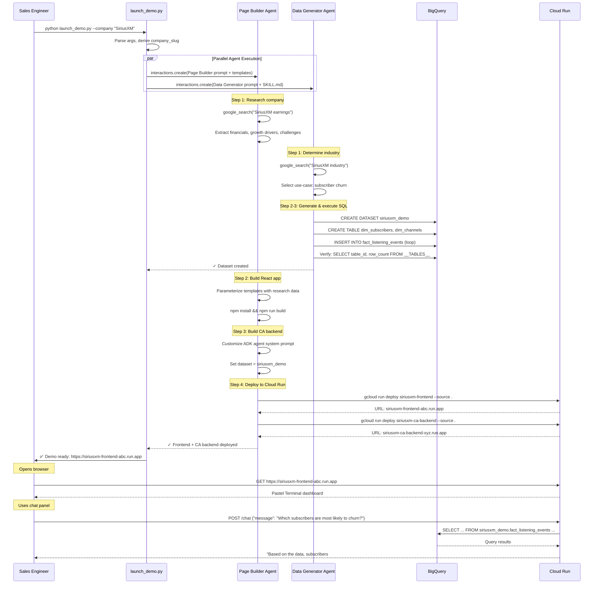

# Agent-Built Demos — Design Document

**Version:** 1.0
**Date:** 2026-08-10
**Author:** Cloud GTM Engineering
**Status:** Draft

---

## Part 1: The Business Problem

### Who is the user?

The primary user is a **Google Cloud Sales Engineer** (SE). SEs are the technical people on Google Cloud's sales team whose job is to show potential customers how Google Cloud products work. Before a customer meeting, an SE often needs to build a **live, interactive demo** tailored to that specific company — showing data and visuals that look like they belong to the prospect's industry and business.

### What is the pain today?

Building a company-specific demo is painful and slow. The SE has to:

1. **Research the company** — look up financial data, recent earnings, what industry they are in, what challenges they face.
2. **Create fake data** — write SQL scripts to generate a realistic synthetic dataset (for example, subscriber records for a media company, or transaction logs for a retailer).
3. **Build a webpage** — create a dashboard-style web page that displays the research results and connects to the data.
4. **Deploy everything** — get the webpage and data service running on the internet so it can be shown during the meeting.

This process takes **hours to days** per company. The result varies wildly depending on who builds it, and the effort is largely repeated for every new prospect.

### What does this system do?

**Agent-Built Demos** replaces the entire manual workflow with a single command:

```
python launch_demo.py --company "SiriusXM"
```

Behind the scenes, two AI agents work in parallel:

- **Agent 1 (the Page Builder)** researches the company on the web, creates a polished dashboard webpage with the company's financials, growth drivers, and market challenges, and deploys it to the internet. It also builds and deploys a second AI — a "Conversational Analytics" chatbot that can answer plain-English questions about the company's data.

- **Agent 2 (the Data Generator)** creates a realistic synthetic dataset tailored to the company's industry (for instance, subscriber listening behavior for a music streaming company) and loads it into **BigQuery** — Google Cloud's data warehouse, which is essentially a large-scale database you can query with SQL.

Within about 10 minutes, the SE gets a live URL they can open in a browser and show to a customer. No manual steps required.

### Why does this matter to Google Cloud sales?

This demo is designed to sell **Agentic AI on Google Cloud**. The headline story is recursive: *an AI agent builds and deploys another AI agent on the fly*. The Page Builder (Agent 1) is itself an AI agent, and one of the things it does is author, configure, and deploy a *second* AI agent (the Conversational Analytics chatbot). That chatbot then answers questions about data that was created by a *third* agent (Agent 2) running in parallel.

This "Agents building Agents" moment makes the demo memorable because it shows a customer that Google Cloud's AI platform can do more than answer questions — it can autonomously create and deploy new AI-powered applications without human intervention.

---

## Part 2: Technical Design

### Plain-English Overview

The system has four big moving pieces, plus a thin command-line wrapper that ties them together:

1. **The CLI Orchestrator (`launch_demo.py`)** — A Python script the SE runs on their laptop. It takes a company name, kicks off two Managed Agents in parallel via the Gemini API (Google's large-language-model service), and prints milestone updates to the terminal. It does not do any heavy lifting itself; it just dispatches work and reports progress.

2. **The Page Builder Managed Agent** — An AI agent running in a Google-hosted Linux sandbox (called an "Antigravity environment"). It uses web search to research the company, generates a React web application following the "Pastel Terminal" design system, builds a Conversational Analytics (CA) backend agent using Google's ADK (Agent Development Kit — a Python framework for building AI agents), and deploys both the frontend and backend to Cloud Run (Google's serverless container hosting platform).

3. **The Data Generator Managed Agent** — A second AI agent running in its own sandbox. It determines the company's industry, selects an appropriate analytics use-case (for example, subscriber churn for media companies), generates a BigQuery SQL script following the `analytics-data-generator` skill methodology, executes it against BigQuery, and verifies the data is complete.

4. **The Conversational Analytics (CA) Agent** — This is the agent that *gets built* by the Page Builder. It is an ADK Python agent running on Cloud Run that receives natural-language questions from the webpage chat panel, translates them into SQL queries, runs them against the BigQuery dataset, and returns answers. It uses Gemini 2.5 Flash as its language model.

**What is pre-built vs. generated on the fly?** The project repository contains pre-built templates: the Pastel Terminal design system CSS, React component skeletons, the ADK agent skeleton (server entry point, Dockerfile, etc.), the `analytics-data-generator` SKILL.md, and the CLI script. At runtime, the agents *fill in* company-specific content: the research data, the dataset schema, the SQL script, the React component props, the CA agent's system prompt, and the BigQuery connection details.

**How does it start, what happens in the middle, and what does the user see at the end?** The SE runs the CLI. The CLI creates two Interactions (API calls to the Gemini API) in parallel, each in its own remote sandbox. The Page Builder researches, builds, and deploys. The Data Generator generates and loads data. The CLI monitors both interactions' `output_text` for milestone keywords and prints them. When both complete, the CLI prints the Cloud Run URL. The SE opens the URL and sees a Pastel Terminal dashboard with live company data and a working chat interface.

**How does this fit into the broader Google Cloud ecosystem?** The system showcases five Google Cloud services working together: Gemini API (for the Managed Agents), Cloud Run (for hosting), BigQuery (for data), ADK (for the runtime agent), and Google Search (built into the Managed Agent tools). This is a "better together" story that maps directly to the customer's potential architecture.

---

### 2a. CLI Orchestrator (`launch_demo.py`)

#### Parallel Agent Invocation

The CLI uses the **Gemini API Python SDK** (`google-genai`) to create two Interactions simultaneously. Each Interaction is a call to `client.interactions.create()` with the `agent` parameter set to a pre-registered Managed Agent ID (or using inline `system_instruction` + `environment` sources).

The two calls are launched concurrently using Python's `asyncio` or `concurrent.futures.ThreadPoolExecutor`. Each call blocks until the Managed Agent completes (the Interactions API is synchronous — it returns when the agent finishes), but since they run in parallel threads/tasks, both agents work simultaneously.

```
# Conceptual SDK usage (not code — just documentation):
client = genai.Client()

# Page Builder interaction
pb_interaction = client.interactions.create(
    agent="page-builder-agent",  # or inline config
    input="Build a demo for {company}...",
    system_instruction=PAGE_BUILDER_PROMPT,
    environment={
        "type": "remote",
        "sources": [
            {"type": "inline", "target": ".agents/skills/...", "content": "..."},
            # ... template files mounted via inline sources
        ]
    },
)

# Data Generator interaction (runs in parallel)
dg_interaction = client.interactions.create(
    agent="antigravity-preview-05-2026",
    input="Generate data for {company}...",
    system_instruction=DATA_GENERATOR_PROMPT,
    environment={
        "type": "remote",
        "sources": [
            {"type": "inline", "target": ".agents/skills/analytics-data-generator/SKILL.md", "content": "..."},
        ]
    },
)
```

#### Progress Tracking

The CLI does NOT stream raw agent logs. Instead, it uses milestone-based progress:

1. When each `interactions.create()` call is dispatched, the CLI prints `[Agent Name] Starting...`.
2. When each call returns, the CLI inspects `interaction.output_text` for known success markers (e.g., the Data Generator confirms row counts; the Page Builder reports Cloud Run URLs).
3. The CLI parses the output and prints milestone messages: `✓ Dataset created`, `✓ Frontend deployed`, etc.
4. The final Cloud Run URL is extracted from the Page Builder's output text using string parsing (looking for `https://...run.app`).

#### Error Handling

- If `interaction.status` is not `"completed"` (e.g., the agent timed out or failed), the CLI prints a friendly error: `❌ [Page Builder] Failed: {interaction.output_text[:200]}`.
- Exceptions from the SDK (network errors, auth errors) are caught and displayed as actionable messages (e.g., "Check that GOOGLE_API_KEY is set").
- No stack traces are shown to the user.

#### Final URL

When both agents succeed, the CLI prints:

```
✅ Demo ready: https://{company_slug}-frontend-abc123.us-central1.run.app
```

---

### 2b. Page Builder Managed Agent

#### System Instruction Summary

The Page Builder receives a system instruction that tells it:

> You are a web application builder. Given a company name, you will: (1) research the company using web search, (2) build a React application using the Pastel Terminal design system, (3) build a Conversational Analytics ADK backend, and (4) deploy both to Cloud Run. You have access to code execution, web search, URL reading, and filesystem tools. You must follow the design system specification exactly. You must deploy using `gcloud run deploy --source .`.

The full prompt includes the design system spec (from `DESIGN.md`), the layout specification (from `code.html`), and explicit instructions for each section of the dashboard.

#### Tools Used

| Tool | Purpose |
|---|---|
| `google_search` | Research company financials, earnings, growth drivers, challenges |
| `url_context` | Fetch and read specific web pages (earnings reports, press releases) |
| `code_execution` | Run bash, npm, Python commands; install packages; build projects |
| Filesystem (auto-enabled via `environment`) | Write, read, edit files in the sandbox |

#### Expected Execution Steps

**Step 1: Research the company via web search**
- Search for `"{company} Q3 earnings 2026"`, `"{company} stock price"`, `"{company} growth drivers"`, `"{company} market challenges"`.
- Extract: ticker symbol, stock price, trend percentage, EPS (actual vs. estimate), revenue (actual vs. estimate), gross margin, 3 growth drivers with descriptions, 3 market challenges with descriptions.
- Store findings as structured data for template parameterization.

**Step 2: Generate the React application from the design system**
- The agent starts from pre-built template files mounted into the sandbox via inline sources:
  - `package.json` — React + Vite project configuration
  - `src/design-tokens.css` — The Pastel Terminal design system CSS variables
  - `src/components/` — Skeleton React component files (Header, TickerChart, EarningsRecap, GrowthDrivers, MarketChallenges, ConversationalAnalytics)
- The agent fills in company-specific data into the component props/content.
- The agent generates an SVG chart path for the stock price trend.
- The agent runs `npm install && npm run build` to produce a static build.

**Step 3: Build the ADK-based Conversational Analytics backend (Phase 2)**
- The agent starts from a pre-built CA backend skeleton:
  - `ca-backend/agent.py` — ADK agent definition with placeholder system prompt
  - `ca-backend/requirements.txt` — Dependencies (google-adk, google-cloud-bigquery)
  - `ca-backend/Dockerfile` — Container configuration
- The agent customizes the CA agent's system prompt with the company name, dataset name, and table schema.
- The agent generates 3 suggested prompt buttons based on the dataset's use-case.
- The agent runs `pip install -r requirements.txt` to verify dependencies.

**Step 4: Deploy both to Cloud Run**
- Deploy the frontend: `gcloud run deploy {company_slug}-frontend --source ./frontend-build --region us-central1 --project firstargolisproject-338816 --allow-unauthenticated`
- Deploy the CA backend: `gcloud run deploy {company_slug}-ca-backend --source ./ca-backend --region us-central1 --project firstargolisproject-338816 --allow-unauthenticated`
- Capture the Cloud Run service URLs from the deploy output.

#### Pre-built vs. Generated

| Artifact | Pre-built (checked in) | Generated by agent |
|---|---|---|
| `package.json` | ✅ | |
| `design-tokens.css` | ✅ | |
| Component skeletons | ✅ (structure only) | ✅ (company-specific props/data) |
| CA backend skeleton | ✅ | ✅ (system prompt, schema, suggested prompts) |
| Dockerfiles | ✅ | |
| Company research data | | ✅ |
| SVG chart paths | | ✅ |

#### CA Backend ↔ BigQuery Connection

The CA backend connects to BigQuery using the **ADK BigQuery tool integration** (or direct `google-cloud-bigquery` Python client). The agent's system prompt includes the dataset name (`{company_slug}_demo`) and project ID. The CA agent uses BigQuery's `INFORMATION_SCHEMA.COLUMN_FIELD_PATHS` view to discover table columns and their `OPTIONS(description=...)` metadata — this is how the CA agent "understands" the schema without hardcoded knowledge.

> [!IMPORTANT]
> **Open design decision: ADK BigQuery MCP tools vs. direct client.** The PRD references "BigQuery MCP tools." ADK supports MCP tool registration. We need to decide whether the CA agent uses a BigQuery MCP server (hosted or local) or wraps `google-cloud-bigquery` calls directly. Recommendation: Use the BigQuery MCP tools via ADK's `mcp_server` tool type for consistency with the Managed Agent's own MCP capabilities.

#### Frontend ↔ CA Backend Health Check (Status Indicator)

The CA backend exposes a `GET /health` endpoint that returns `{"status": "healthy", "dataset": "{company_slug}_demo", "tables": [...]}`. The frontend polls this endpoint every 5 seconds. The status indicator transitions:

- **Gray (●):** Backend unreachable (initial state or network error).
- **Yellow (●):** Backend is reachable but dataset validation is in progress.
- **Green (●):** Backend is healthy and dataset has been verified.

---

### 2c. Data Generator Managed Agent

#### System Instruction Summary

The Data Generator receives a system instruction that tells it:

> You are an expert Google Cloud Data Engineer. Given a company name, determine its industry, select a revenue-focused analytics use-case, and generate a BigQuery SQL script following the `analytics-data-generator` skill methodology. Execute the script, then verify the dataset using the Agent-Readiness Checklist.

The full `analytics-data-generator` SKILL.md is mounted into the sandbox at `.agents/skills/analytics-data-generator/SKILL.md`.

#### Industry & Use-Case Selection (Step 0)

The agent first determines the company's industry using web search. Then it consults the Use-Case Lookup table in the SKILL.md:

| Industry | Example Use-Cases |
|---|---|
| Media / Entertainment | Channel removal impact on churn; renewal promotion effectiveness |
| Retail | Seasonal campaign lift; customer churn by loyalty segment |
| SaaS / Tech | Feature adoption impact on expansion revenue; cohort retention |
| Financial Services | Cross-sell conversion rates; fraud detection patterns |
| Manufacturing | Predictive maintenance ROI; defect rates by shift |
| Telco | Plan upgrade propensity; network congestion impact on satisfaction |

The agent selects the use-case that is most relevant to the specific company and documents it as a SQL comment.

#### Expected Execution Steps

**Step 1: Determine company industry and select use-case**
- Use `google_search` to confirm the company's industry.
- Select a use-case from the SKILL.md lookup table.

**Step 2: Generate the BigQuery SQL script following the Generation Blueprint**
- Follow the 5-step Generation Blueprint from the SKILL.md:
  1. **Variable Declaration** — `DECLARE` statements at the top (`start_date`, `end_date` using `CURRENT_DATE()`, `outlier_prob`).
  2. **Stable Entities** — `CREATE TEMP TABLE` with deterministic attributes via `FARM_FINGERPRINT`.
  3. **Time Loop** — `LOOP` structure generating time-series data day-by-day.
  4. **Logic-Driven Metrics** — `Base_Value * Time_Curve * Entity_Factor * Random_Variance`.
  5. **Final DDL with Verbose Descriptions** — Every column gets `OPTIONS(description="...")`.
- Name the dataset `{company_slug}_demo` in project `firstargolisproject-338816`.
- Use `dim_` prefix for dimension tables, `fact_` prefix for fact tables.
- Hardcode at least 2 "worst actor" entities.

**Step 3: Execute the SQL script against BigQuery**
- The agent uses its `code_execution` tool to run the SQL via `bq query` CLI or the BigQuery MCP tool.
- The script handles cleanup (`DROP TABLE IF EXISTS`) for idempotency.

**Step 4: Run the Agent-Readiness Checklist verification**
- Verify dataset exists and is accessible.
- Run `SELECT table_id, row_count FROM {dataset}.__TABLES__` to confirm all tables have rows.
- Verify column descriptions are present.
- Confirm at least 2 worst-actor entities exist.
- Confirm date range includes `CURRENT_DATE()`.
- Run the verification query and report results.

#### BigQuery MCP Tools

The Data Generator agent uses `code_execution` to invoke `bq` CLI commands or can use a BigQuery MCP server if registered. The primary operations are:

- `bq query --use_legacy_sql=false --project_id=firstargolisproject-338816 < script.sql` — Execute the generation script.
- `bq ls firstargolisproject-338816:{company_slug}_demo` — List tables.
- `bq query "SELECT table_id, row_count FROM ..."` — Verify row counts.

> [!IMPORTANT]
> **Open design decision: BigQuery MCP vs. `bq` CLI.** The Managed Agent sandbox has `gcloud` pre-installed, so `bq` CLI is available. Alternatively, a BigQuery MCP server could be registered as a tool. Using `bq` CLI via `code_execution` is simpler and avoids MCP server setup. Recommendation: Use `bq` CLI for the Data Generator; use BigQuery MCP tools only for the CA agent (where runtime query execution requires a tighter integration).

---

### 2d. The Conversational Analytics (CA) Agent

#### Framework & Model

- **Framework:** Google ADK (Agent Development Kit) — Google's Python framework for building AI agents with tool use.
- **Model:** Gemini 2.5 Flash — selected for fast inference, cost-effectiveness, and strong SQL generation capability.
- **Runtime:** Runs as a Python web server on Cloud Run, exposing HTTP API endpoints.

#### Schema Discovery

The CA agent discovers the BigQuery schema at startup by querying:

```sql
SELECT table_name, column_name, data_type, description
FROM `{project}.{dataset}.INFORMATION_SCHEMA.COLUMN_FIELD_PATHS`
```

It uses the `OPTIONS(description=...)` metadata from each column — which includes business meaning, value ranges, and foreign key references — to understand the data without any hardcoded schema knowledge. This is why the Data Generator's column descriptions are so important: they are the CA agent's entire understanding of the data.

#### System Prompt (Conceptual)

The CA agent's system prompt tells it:

> You are a Conversational Analytics assistant for {company_name}. You answer questions about {use_case} using data in `{project}.{dataset}`. You have access to a BigQuery tool. When a user asks a question: (1) determine which tables and columns are relevant using the schema descriptions, (2) generate a SQL query, (3) execute the query, (4) summarize the results in plain English. You MUST only query tables in the `{dataset}` dataset. You MUST NOT modify data. If a question is outside the scope of the available data, say so.

#### Query Execution Flow

1. User types a question in the chat panel.
2. The frontend sends a POST to `{ca_backend_url}/chat` with `{"message": "..."}`.
3. The CA agent receives the message, consults the schema, generates a BigQuery SQL query.
4. The CA agent executes the query via its BigQuery tool.
5. The CA agent interprets the results and generates a natural-language response.
6. The response is returned as `{"response": "...", "sql": "..."}`.
7. The frontend displays the response in a chat bubble. If `sql` is present, it is available behind a "Show SQL" toggle.

---

### 2e. Deployment Architecture

#### Cloud Run Services

| Service | Name Pattern | Contents | Port |
|---|---|---|---|
| Frontend | `{company_slug}-frontend` | Static React build served via nginx or a Node.js server | 8080 |
| CA Backend | `{company_slug}-ca-backend` | ADK Python agent with HTTP API | 8080 |

#### API Contract (Frontend → CA Backend)

| Endpoint | Method | Request | Response |
|---|---|---|---|
| `/health` | GET | — | `{"status": "healthy", "dataset": "...", "tables": [...]}` |
| `/chat` | POST | `{"message": "string"}` | `{"response": "string", "sql": "string \| null"}` |

#### Health-Check Mechanism

- Cloud Run's built-in HTTP health check pings the `/health` endpoint.
- The frontend JavaScript polls `/health` every 5 seconds and updates the status indicator.
- The CA backend's `/health` handler verifies it can reach BigQuery and that the target dataset exists.

#### GCP Configuration

| Parameter | Value |
|---|---|
| **Project ID** | `firstargolisproject-338816` (parameterizable via `--project`) |
| **Region** | `us-central1` |
| **Service Account** | Default Compute Engine service account |
| **Authentication** | `--allow-unauthenticated` (public demo URLs) |
| **Deploy method** | `gcloud run deploy --source .` (source-based build) |

#### Idempotency

Re-running the same company cleanly replaces previous artifacts:

- **BigQuery:** The SQL script starts with `DROP TABLE IF EXISTS` and `CREATE OR REPLACE TABLE`, so re-running overwrites the dataset.
- **Cloud Run:** Deploying to the same service name (`{company_slug}-frontend`) replaces the existing revision. Cloud Run handles this natively.
- **No cleanup required:** The system is idempotent by default. A `--cleanup` flag (Phase 3) will add explicit deletion of old services and datasets.

---

### End-to-End Sequence Diagram



---

## Appendix: Glossary

| Term | Definition |
|---|---|
| **Antigravity** | Google's Agentic IDE, also available as a Managed Agent via the Gemini API. Provides a persistent Linux sandbox with pre-installed tools. |
| **Managed Agent** | An AI agent hosted by Google that runs in a remote sandbox. Invoked via `client.interactions.create()` in the Gemini API Python SDK. |
| **Interaction** | A single request-response cycle with a Managed Agent. The agent reasons, uses tools, and returns `output_text` when done. |
| **ADK (Agent Development Kit)** | Google's Python framework for building AI agents with tool use and function calling. |
| **BigQuery** | Google Cloud's serverless data warehouse — a fully managed database you query with SQL. |
| **Cloud Run** | Google Cloud's serverless container hosting platform. Deploys and runs containers with auto-scaling. |
| **Gemini 2.5 Flash** | A fast, cost-effective language model from Google, optimized for tool use and code generation. |
| **MCP (Model Context Protocol)** | A protocol for registering external tool servers that AI agents can call at runtime. |
| **Pastel Terminal** | The custom design system for the demo dashboard. Characterized by lavender/mint/peach pastels, Space Grotesk and IBM Plex Mono typography, and flat 1px-border styling. |
| **CA (Conversational Analytics)** | The AI chatbot that answers natural-language questions about the synthetic BigQuery dataset. |
| **SKILL.md** | A markdown instruction file that defines specialized behavior for an Antigravity agent. Mounted into the agent's sandbox at `.agents/skills/{name}/SKILL.md`. |
