# Agent-Built Demos — Implementation Plan

**Version:** 1.0
**Date:** 2026-08-10
**Author:** Cloud GTM Engineering
**Status:** Draft

---

## Section 1: Project Root & Configuration

**Dependencies:** None — this is the starting point.
**Estimated complexity:** Low
**Phase:** 1 (MVP)

| # | Path | Status | Description |
|---|---|---|---|
| 1 | `pyproject.toml` | [NEW] | Python project metadata and dependency management. Declares `google-genai` as the primary dependency plus `click` for CLI argument parsing. Sets Python ≥ 3.11. Defines the `launch-demo` console entry point. |
| 2 | `requirements.txt` | [NEW] | Flat dependency list for users who prefer `pip install -r`. Contains `google-genai>=1.0`, `click>=8.0`, `rich>=13.0` (for terminal formatting). |
| 3 | `.env.example` | [NEW] | Template for required environment variables. Contains `GOOGLE_API_KEY=your-key-here`, `GCP_PROJECT=firstargolisproject-338816`, `GCP_REGION=us-central1`. Includes comments explaining each variable. |
| 4 | `.gitignore` | [NEW] | Standard Python `.gitignore` plus `.env`, `node_modules/`, `dist/`, `build/`, `__pycache__/`, `.venv/`, `*.pyc`. |
| 5 | `README.md` | [NEW] | Project overview, quickstart (prerequisites, setup, single command), architecture diagram, project structure, customization guide, and troubleshooting. References the PRD and Design Doc. |
| 6 | `LICENSE` | [NEW] | Apache 2.0 license file (standard for Google Cloud demo projects). |

---

## Section 2: CLI Orchestrator

**Dependencies:** Section 1 (project config must be defined first).
**Estimated complexity:** Medium
**Phase:** 1 (MVP)

| # | Path | Status | Description |
|---|---|---|---|
| 7 | `src/__init__.py` | [NEW] | Package marker. Empty file. |
| 8 | `src/launch_demo.py` | [NEW] | Main CLI entry point. Accepts `--company` (required), `--ticker` (optional), `--project` (default: `firstargolisproject-338816`), `--region` (default: `us-central1`). Derives `company_slug` from company name. Loads system instructions and template files from disk. Dispatches two `client.interactions.create()` calls in parallel using `concurrent.futures.ThreadPoolExecutor`. Monitors results and prints milestone output using Rich console formatting. Extracts the Cloud Run URL from the Page Builder's output. Handles errors gracefully (no stack traces). |
| 9 | `src/agents/__init__.py` | [NEW] | Package marker for agent invocation modules. |
| 10 | `src/agents/page_builder.py` | [NEW] | Contains `invoke_page_builder(client, company, ticker, company_slug, project, region) -> InteractionResult`. Reads the Page Builder system instruction from `prompts/page_builder_system.md`. Reads all template files from `templates/page-builder/` and constructs inline environment sources. Calls `client.interactions.create()` with the assembled configuration. Returns a structured result object with the output text, Cloud Run URLs (parsed from output), and status. |
| 11 | `src/agents/data_generator.py` | [NEW] | Contains `invoke_data_generator(client, company, company_slug, project) -> InteractionResult`. Reads the Data Generator system instruction from `prompts/data_generator_system.md`. Reads the SKILL.md from `skills/analytics-data-generator/SKILL.md` and mounts it as an inline source at `.agents/skills/analytics-data-generator/SKILL.md`. Calls `client.interactions.create()`. Returns a structured result with dataset name, table counts, and status. |
| 12 | `src/config.py` | [NEW] | Central configuration constants: default project ID, default region, agent ID (`antigravity-preview-05-2026`), service naming patterns (`{slug}-frontend`, `{slug}-ca-backend`), and path constants for prompts/templates directories. Also contains the `slugify(company_name) -> str` function that lowercases and replaces non-alphanumeric chars with underscores. |
| 13 | `src/output.py` | [NEW] | Terminal output formatting using Rich. Contains `print_banner(company)`, `print_milestone(agent_name, message)`, `print_success(url)`, `print_error(agent_name, message)` functions. Encapsulates all Rich console markup so the rest of the codebase stays clean. |
| 14 | `src/result_parser.py` | [NEW] | Parses `interaction.output_text` from each agent. Contains `extract_cloud_run_url(output_text) -> str` (regex for `https://...run.app`), `extract_dataset_name(output_text) -> str`, `extract_milestones(output_text) -> list[str]`. Used by `launch_demo.py` to produce clean CLI output. |

---

## Section 3: Managed Agent Prompts & Configuration

**Dependencies:** Sections 1 & 2 (must know the prompt file paths referenced by the CLI).
**Estimated complexity:** High (these are the most important files — they control agent behavior).
**Phase:** 1 (MVP) for Page Builder static; Phase 2 for CA backend sections of the Page Builder prompt.

> [!IMPORTANT]
> These prompt files are the most critical deliverables in the project. They are the "source code" that controls what each Managed Agent does. They should be iterated on extensively and tested against multiple companies before being considered stable.

| # | Path | Status | Description |
|---|---|---|---|
| 15 | `prompts/page_builder_system.md` | [NEW] | System instruction for the Page Builder Managed Agent. This is a multi-section prompt that tells the agent exactly what to do, in what order. Sections: (1) Role definition — "You are a web application builder." (2) Company research instructions — what to search for, what data to extract, expected output format. (3) React application instructions — reference to the design system, component list, layout grid, how to parameterize templates. (4) CA backend instructions (Phase 2) — how to customize the ADK agent, set the system prompt, configure BigQuery connection. (5) Deployment instructions — exact `gcloud run deploy` commands with flag specifications. (6) Output format — what to print at the end (Cloud Run URLs) so the CLI can parse them. (7) Error handling — what to do if web search returns insufficient data, if build fails, if deploy fails. |
| 16 | `prompts/data_generator_system.md` | [NEW] | System instruction for the Data Generator Managed Agent. Sections: (1) Role definition — "You are an expert Google Cloud Data Engineer." (2) Industry determination — use web search to identify the company's industry. (3) Use-case selection — reference the SKILL.md's Use-Case Lookup table. (4) SQL generation — follow the Generation Blueprint exactly (Steps 1–5). (5) Execution instructions — run the SQL script using `bq query --use_legacy_sql=false`. (6) Verification — run the Agent-Readiness Checklist. (7) Output format — print dataset name, table names, row counts, and verification query results. |
| 17 | `prompts/ca_agent_system_template.md` | [NEW] | Template for the CA agent's system prompt. Contains placeholders: `{{COMPANY_NAME}}`, `{{DATASET_NAME}}`, `{{PROJECT_ID}}`, `{{SCHEMA_DESCRIPTION}}`, `{{USE_CASE}}`. The Page Builder reads this template, fills in the placeholders with company-specific data, and writes it into the CA backend's `agent.py`. This template defines the CA agent's personality, capabilities, restrictions (query only the target dataset), and response format (plain English + optional SQL). |

---

## Section 4: Page Builder Templates & Scaffolding

**Dependencies:** Section 3 (the Page Builder prompt references these templates by path).
**Estimated complexity:** Medium
**Phase:** 1 (MVP)

These files are checked into the repository and mounted into the Page Builder's sandbox via inline environment sources. The agent reads them, parameterizes them with company-specific data, and uses them to build the React application.

### Frontend React Application

| # | Path | Status | Description |
|---|---|---|---|
| 18 | `templates/page-builder/frontend/package.json` | [NEW] | Vite + React project configuration. Declares dependencies: `react`, `react-dom`, `vite`, `@vitejs/plugin-react`. Defines `build` and `dev` scripts. The agent does NOT modify this file — it is used as-is. |
| 19 | `templates/page-builder/frontend/vite.config.js` | [NEW] | Vite configuration. Sets the React plugin, output directory (`dist`), and base path (`/`). |
| 20 | `templates/page-builder/frontend/index.html` | [NEW] | HTML entry point for the React app. Includes Google Fonts links (Space Grotesk, IBM Plex Mono, Material Symbols Outlined), a `
`, and the Vite module script tag. The agent does NOT modify this file. |
| 21 | `templates/page-builder/frontend/src/main.jsx` | [NEW] | React entry point. Renders `<App />` into the root div. Imports `design-tokens.css`. |
| 22 | `templates/page-builder/frontend/src/design-tokens.css` | [NEW] | CSS custom properties derived from the Pastel Terminal DESIGN.md. Contains all color tokens (`--color-primary: #645787`, etc.), typography scales, spacing values, border-radius values. Also includes base reset styles, grid layout utilities, and component-level classes (`.panel`, `.status-pill`, `.data-value`, `.growth-item`, `.challenge-item`). This is the complete design system implementation — the agent references these classes when building components. |
| 23 | `templates/page-builder/frontend/src/App.jsx` | [NEW] | Main application shell. Contains the 12-column grid layout matching the `code.html` reference. Imports and composes all section components: `Header`, `TickerChart`, `EarningsRecap`, `GrowthDrivers`, `MarketChallenges`, `ConversationalAnalytics`. Uses placeholder props (`{{TICKER}}`, `{{COMPANY_NAME}}`, etc.) that the agent replaces with real data. |
| 24 | `templates/page-builder/frontend/src/components/Header.jsx` | [NEW] | Top navigation bar component. Displays "PASTEL TERMINAL" branding, "DASHBOARD" nav link, and user avatar icon. Matches the fixed header from `code.html`. Props: none (static). |
| 25 | `templates/page-builder/frontend/src/components/TickerChart.jsx` | [NEW] | Left panel (6 columns). Displays company ticker, full name, industry, stock price, trend percentage (with mint/peach pill), and an SVG line chart. Props: `ticker`, `companyName`, `industry`, `price`, `trendPercent`, `chartPath` (SVG path data). |
| 26 | `templates/page-builder/frontend/src/components/EarningsRecap.jsx` | [NEW] | Right panel (6 columns). Displays EPS (actual vs. estimate), Revenue (actual vs. estimate), and Gross Margin (progress bar with target). Props: `eps`, `epsEstimate`, `revenue`, `revenueEstimate`, `grossMargin`, `grossMarginTarget`, `quarter`. |
| 27 | `templates/page-builder/frontend/src/components/GrowthDrivers.jsx` | [NEW] | Bottom-left panel (6 columns). Displays 3 growth drivers with `+` indicators, titles, and descriptions. Mint-washed header. Props: `drivers: [{title, description}]`. |
| 28 | `templates/page-builder/frontend/src/components/MarketChallenges.jsx` | [NEW] | Bottom-right panel (6 columns). Displays 3 market challenges with `-` indicators, titles, and descriptions. Peach-washed header. Props: `challenges: [{title, description}]`. |
| 29 | `templates/page-builder/frontend/src/components/ConversationalAnalytics.jsx` | [NEW] | Full-width panel (12 columns). Contains the chat interface: status indicator (dot + "System Online"), message area (AI welcome bubble, user message bubbles), text input with send button, and 3 suggested prompt buttons. In Phase 1, displays "Coming Soon" state. In Phase 2, connects to the CA backend via `fetch()` to `/chat`. Props: `backendUrl`, `suggestedPrompts: [string]`, `companyName`. |

### Frontend Deployment

| # | Path | Status | Description |
|---|---|---|---|
| 30 | `templates/page-builder/frontend/Dockerfile` | [NEW] | Multi-stage Dockerfile for the frontend. Stage 1: Node.js build (`npm ci && npm run build`). Stage 2: nginx serving the `dist/` directory on port 8080. Lightweight, production-ready. |
| 31 | `templates/page-builder/frontend/nginx.conf` | [NEW] | Nginx configuration for serving the SPA. Routes all paths to `index.html` for client-side routing. Sets cache headers for static assets. Configures port 8080 (Cloud Run default). |

---

## Section 5: CA Backend (ADK Agent) Templates

**Dependencies:** Section 3 (the Page Builder prompt references these templates).
**Estimated complexity:** Medium
**Phase:** 2 (Conversational Analytics)

| # | Path | Status | Description |
|---|---|---|---|
| 32 | `templates/page-builder/ca-backend/agent.py` | [NEW] | ADK agent definition. Uses `google.adk.Agent` to create a conversational agent with Gemini 2.5 Flash. Contains a placeholder system prompt (`{{CA_SYSTEM_PROMPT}}`). Registers a BigQuery query tool (either via MCP or direct client) that accepts a SQL string and returns results as JSON. Exposes HTTP endpoints: `POST /chat` (accepts `{"message": "..."}`, returns `{"response": "...", "sql": "..."}`), `GET /health` (returns dataset status). |
| 33 | `templates/page-builder/ca-backend/bigquery_tool.py` | [NEW] | BigQuery query execution tool for the CA agent. Contains a function `execute_bigquery_query(sql: str, project: str, dataset: str) -> dict` that validates the SQL only references tables in the allowed dataset, executes via `google-cloud-bigquery`, and returns results as a list of dicts. Includes schema discovery function `get_dataset_schema(project, dataset) -> str` that queries `INFORMATION_SCHEMA.COLUMN_FIELD_PATHS` and formats column descriptions for the agent's context. |
| 34 | `templates/page-builder/ca-backend/requirements.txt` | [NEW] | Python dependencies for the CA backend: `google-adk>=0.5`, `google-cloud-bigquery>=3.0`, `flask>=3.0` (or `uvicorn` + `fastapi` — depends on ADK's preferred server). |
| 35 | `templates/page-builder/ca-backend/Dockerfile` | [NEW] | Python Dockerfile for the CA backend. Installs dependencies from `requirements.txt`, copies source code, exposes port 8080, sets `CMD` to run the ADK server. Uses `python:3.11-slim` base image. |
| 36 | `templates/page-builder/ca-backend/server.py` | [NEW] | HTTP server wrapper for the ADK agent. Sets up Flask/FastAPI routes that map to the ADK agent's conversation methods. Handles CORS (the frontend is on a different Cloud Run URL). Implements the `/health` endpoint that checks BigQuery connectivity and dataset existence. |

---

## Section 6: Data Generator Skill & Supporting Files

**Dependencies:** None — this is an existing skill being enhanced.
**Estimated complexity:** Low (the SKILL.md already exists and was recently updated).
**Phase:** 1 (MVP)

| # | Path | Status | Description |
|---|---|---|---|
| 37 | `skills/analytics-data-generator/SKILL.md` | [MODIFY] | The existing skill file. Already contains the full Generation Blueprint, Use-Case Lookup table, naming conventions, and Agent-Readiness Checklist. No functional changes needed for Phase 1. May need minor updates for Phase 2 (e.g., adding CA-agent-specific verification queries). The file is mounted into the Data Generator's sandbox at `.agents/skills/analytics-data-generator/SKILL.md`. |
| 38 | `skills/analytics-data-generator/examples/media_entertainment.sql` | [NEW] | Example SQL script for the Media/Entertainment industry (e.g., SiriusXM). Demonstrates the complete Generation Blueprint output for a subscriber churn use-case. Includes `dim_subscribers`, `dim_channels`, `fact_listening_events` with worst-actor patterns. Serves as a reference for the Data Generator agent and for developers reviewing the skill. This is documentation, not executed code. |
| 39 | `skills/analytics-data-generator/examples/retail.sql` | [NEW] | Example SQL script for the Retail industry (e.g., Target). Demonstrates a seasonal campaign lift use-case. Includes `dim_customers`, `dim_products`, `fact_transactions`. Same structural purpose as the media example. |

---

## Section 7: Infrastructure & Deployment

**Dependencies:** Sections 4 and 5 (Dockerfiles are defined in templates).
**Estimated complexity:** Low
**Phase:** 1 (MVP)

| # | Path | Status | Description |
|---|---|---|---|
| 40 | `scripts/setup_project.sh` | [NEW] | One-time project setup script. Enables required GCP APIs (`run.googleapis.com`, `bigquery.googleapis.com`, `aiplatform.googleapis.com`). Configures `gcloud` project and region defaults. Verifies authentication. Prints success/failure status. Run once per GCP project. |
| 41 | `scripts/cleanup.sh` | [NEW] | Cleanup script for removing a demo deployment. Accepts `--company-slug` argument. Deletes the Cloud Run frontend and CA backend services. Drops the BigQuery dataset. Prints what was deleted. For Phase 3's `--cleanup` CLI flag, this logic will be integrated into `launch_demo.py`. |
| 42 | `.cloudbuild.yaml` | [NEW] | Cloud Build configuration (optional, for CI/CD in Phase 3). Defines build steps for running the demo end-to-end as a test. Not used in Phases 1-2 but included as scaffolding. |

---

## Section 8: Testing & Verification

**Dependencies:** Sections 2–6 (all components must exist before they can be tested).
**Estimated complexity:** Medium
**Phase:** 1 (MVP) for smoke tests; Phase 2 for CA tests; Phase 3 for reliability tests.

| # | Path | Status | Description |
|---|---|---|---|
| 43 | `tests/smoke_test.py` | [NEW] | End-to-end smoke test. Runs `launch_demo.py --company "Apple"` and verifies: (1) CLI exits with code 0, (2) output contains a Cloud Run URL, (3) the URL returns HTTP 200, (4) BigQuery dataset `apple_demo` exists with >0 rows in all tables. Uses subprocess to invoke the CLI and `requests` to check the URL. |
| 44 | `tests/test_config.py` | [NEW] | Unit tests for `src/config.py`. Tests `slugify()` with various inputs: "SiriusXM" → "siriusxm", "JPMorgan Chase" → "jpmorgan_chase", "AT&T" → "at_t". |
| 45 | `tests/test_result_parser.py` | [NEW] | Unit tests for `src/result_parser.py`. Tests URL extraction, dataset name extraction, and milestone parsing against sample output text strings. |
| 46 | `tests/test_prompts.py` | [NEW] | Validates prompt files exist and contain expected sections. Checks that `page_builder_system.md` contains deployment instructions, that `data_generator_system.md` references the SKILL.md, and that `ca_agent_system_template.md` contains all required placeholders. |
| 47 | `tests/verify_bq_dataset.py` | [NEW] | Standalone verification script for BigQuery datasets. Accepts `--dataset` argument. Checks row counts, column descriptions, worst-actor presence, and date ranges. Outputs a pass/fail report. Can be run independently after a demo to validate data quality. |
| 48 | `tests/verify_ca_agent.py` | [NEW] | Phase 2 verification script for the CA backend. Accepts `--url` argument. Sends 3 test questions to the `/chat` endpoint and checks that responses contain non-empty text and valid SQL. Also checks `/health` returns `{"status": "healthy"}`. |
| 49 | `tests/companies.txt` | [NEW] | List of test companies for reliability testing (Phase 3). Contains 50 Fortune 500 / NASDAQ-listed company names, one per line. Used by the smoke test suite for batch validation. |

---

## Section 9: Documentation

**Dependencies:** All sections (docs reference the full project structure).
**Estimated complexity:** Low
**Phase:** 1 (MVP)

| # | Path | Status | Description |
|---|---|---|---|
| 50 | `docs/PRD.md` | Exists | The Product Requirements Document. Already written. No changes needed. |
| 51 | `docs/DESIGN_DOC.md` | [NEW] | The Design Document (this deliverable's companion). Covers business problem, technical design, component deep-dives, deployment architecture, and sequence diagrams. |
| 52 | `docs/SETUP_GUIDE.md` | [NEW] | Step-by-step setup guide for new users. Covers: (1) Install prerequisites (Python 3.11+, gcloud CLI, Node.js 20+). (2) Clone the repo. (3) Copy `.env.example` to `.env` and fill in API keys. (4) Run `pip install -r requirements.txt`. (5) Run `scripts/setup_project.sh`. (6) Run `python src/launch_demo.py --company "Apple"`. Includes troubleshooting FAQ. |
| 53 | `docs/CUSTOMIZATION_GUIDE.md` | [NEW] | Guide for Solutions Architects who want to extend the system. Covers: modifying the design system (editing `design-tokens.css`), adding webpage sections (creating new React components), changing the data schema (editing the SKILL.md), swapping the LLM model, and adding custom skills. |
| 54 | `docs/PROMPT_ENGINEERING.md` | [NEW] | Guide for iterating on agent prompts. Explains the prompt structure for both agents, how to test changes (run against a known company and diff the output), common failure modes and their prompt-level fixes, and best practices for system instructions with Managed Agents. |
| 55 | `web-page-design/DESIGN.md` | Exists | The Pastel Terminal design system specification. No changes needed. |
| 56 | `web-page-design/code.html` | Exists | The reference HTML implementation. No changes needed. |
| 57 | `web-page-design/screen.png` | Exists | The visual screenshot reference. No changes needed. |

---

## Summary: Complete File List

| Section | Files | New | Modified | Existing |
|---|---|---|---|---|
| 1. Project Root & Config | 6 | 6 | 0 | 0 |
| 2. CLI Orchestrator | 8 | 8 | 0 | 0 |
| 3. Agent Prompts | 3 | 3 | 0 | 0 |
| 4. Page Builder Templates | 14 | 14 | 0 | 0 |
| 5. CA Backend Templates | 5 | 5 | 0 | 0 |
| 6. Data Generator Skill | 3 | 2 | 1 | 0 |
| 7. Infrastructure | 3 | 3 | 0 | 0 |
| 8. Testing | 7 | 7 | 0 | 0 |
| 9. Documentation | 8 | 4 | 0 | 4 |
| **Total** | **57** | **52** | **1** | **4** |

---

## Build Order

The following is the recommended implementation sequence. Each step depends on the steps before it.

| Order | Section | Rationale |
|---|---|---|
| **1** | **Section 1: Project Root & Config** | Foundation. Every other section depends on the project structure, dependencies, and configuration. |
| **2** | **Section 6: Data Generator Skill** | The SKILL.md already exists and only needs minor enhancement. The example SQL files provide concrete reference points. Starting here lets us validate data generation independently. |
| **3** | **Section 3: Agent Prompts (Data Generator only)** | Write the Data Generator system instruction first. This can be tested immediately using the Gemini API — call `client.interactions.create()` with the prompt and SKILL.md, and verify it produces a working BigQuery dataset. |
| **4** | **Section 2: CLI Orchestrator (Data Generator path only)** | Build the CLI scaffolding and the Data Generator invocation path. At this point, running `python launch_demo.py --company "Apple"` should successfully create a BigQuery dataset (even though the Page Builder isn't ready yet). |
| **5** | **Section 4: Page Builder Templates (frontend only)** | Create the React component skeletons and design system CSS. These are static files that don't require agent integration to validate — they can be previewed locally with `npm run dev`. |
| **6** | **Section 3: Agent Prompts (Page Builder — Phase 1)** | Write the Page Builder system instruction for Phase 1 (static webpage without CA). This is the hardest prompt to get right — it needs to reliably produce a working React app from templates + web search data. |
| **7** | **Section 2: CLI Orchestrator (full parallel execution)** | Complete the CLI to dispatch both agents in parallel, parse results from both, and print the final URL. This is the Phase 1 MVP completion point. |
| **8** | **Section 7: Infrastructure** | Write the setup and cleanup scripts. These support the development workflow and aren't blocking for the core functionality. |
| **9** | **Section 8: Testing (smoke tests)** | Write smoke tests and verification scripts. Run them against the Phase 1 output to validate the end-to-end flow. |
| **10** | **Section 5: CA Backend Templates** | Build the ADK agent skeleton, BigQuery tool, and server wrapper. These are Phase 2 deliverables. |
| **11** | **Section 3: Agent Prompts (Page Builder — Phase 2, CA)** | Extend the Page Builder prompt to include CA backend generation and deployment. This is the "Agents building Agents" moment. |
| **12** | **Section 4: Page Builder Templates (ConversationalAnalytics component — Phase 2)** | Update the `ConversationalAnalytics.jsx` component to connect to the CA backend instead of showing "Coming Soon." |
| **13** | **Section 8: Testing (CA verification)** | Write CA-specific verification tests. Validate the full Phase 2 flow. |
| **14** | **Section 9: Documentation** | Write setup guide, customization guide, and prompt engineering guide. These are best written after the system is working and stable. |

```mermaid
gantt
    title Build Order — Agent-Built Demos
    dateFormat X
    axisFormat %s

    section Phase 1 — MVP
    1. Project Root & Config           :done, s1, 0, 1
    2. Data Generator Skill            :done, s6, 1, 2
    3. Data Generator Prompt           :active, s3a, 2, 3
    4. CLI - Data Generator path       :s2a, 3, 4
    5. Frontend Templates              :s4, 3, 5
    6. Page Builder Prompt (Phase 1)   :crit, s3b, 5, 7
    7. CLI - Full parallel             :s2b, 7, 8
    8. Infrastructure scripts          :s7, 8, 9
    9. Smoke tests                     :s8a, 8, 9

    section Phase 2 — CA Agent
    10. CA Backend Templates           :s5, 9, 11
    11. Page Builder Prompt (Phase 2)  :crit, s3c, 11, 13
    12. CA Frontend Component          :s4b, 11, 12
    13. CA Verification Tests          :s8b, 13, 14

    section Phase 3 — Polish
    14. Documentation                  :s9, 14, 15
```

---

## Open Design Decisions

> [!IMPORTANT]
> **BigQuery access pattern for the CA agent.** Should the CA agent use a BigQuery MCP server (registered via ADK's `mcp_server` tool type) or wrap `google-cloud-bigquery` client calls in a custom function tool? MCP provides a cleaner separation of concerns but adds MCP server hosting complexity. A direct client wrapper is simpler for a demo. **Recommendation:** Start with a direct client wrapper in Phase 2; evaluate MCP in Phase 3 if needed.

> [!IMPORTANT]
> **Frontend framework.** The PRD specifies "React." Should we use Create React App, Vite, or Next.js? Vite is the lightest option and produces the smallest build. Next.js adds server-side rendering complexity that isn't needed for a static dashboard. **Recommendation:** Use Vite + React.

> [!IMPORTANT]
> **CA backend HTTP framework.** ADK agents can be served via multiple HTTP frameworks. Flask is simple but synchronous. FastAPI is async-native and auto-generates OpenAPI docs. **Recommendation:** Use Flask for simplicity in Phase 2; consider FastAPI if async performance becomes an issue in Phase 3.

> [!WARNING]
> **Agent reliability.** The Page Builder prompt is the highest-risk component. Generating a working React application from templates + web search data is nondeterministic. Extensive prompt iteration and testing against 10+ companies is required before Phase 1 can be considered stable. Budget significant time for prompt engineering.

> [!WARNING]
> **gcloud authentication in the sandbox.** The Managed Agent sandbox needs `gcloud` authenticated to deploy to Cloud Run and access BigQuery. This requires either: (a) passing a service account key via environment sources (security concern), or (b) using workload identity federation, or (c) relying on the sandbox's default credentials if it runs in a GCP-connected environment. **This must be validated early — it is a potential blocker.**
