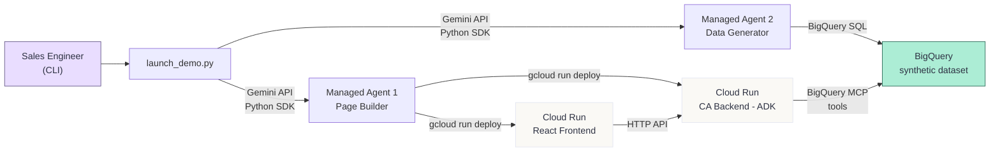

# Agent-Built Demos — Product Requirements Document

**Version:** 1.0  
**Date:** 2026-08-10  
**Author:** Cloud GTM Engineering  
**Status:** Draft

---

## 1. Overview & Problem Statement

### The Problem

Google Cloud Sales Engineers frequently need company-specific Agentic AI demos on short notice—often hours before a customer meeting. Today, building a demo tailored to a prospect's industry and data landscape is a manual, multi-step process:

1. Research the company (financials, industry, recent news).
2. Hand-craft a synthetic dataset that looks plausible.
3. Build or customize a webpage to present the demo.
4. Deploy the application and verify it works.

This process takes **hours to days** per company. It doesn't scale, and the output varies wildly depending on who builds it.

### The Solution

**Agent-Built Demos** is an automated system where a Sales Engineer types a single company name into a CLI, and two Antigravity Managed Agents collaborate to produce a fully deployed, company-specific Agentic AI demo webpage in minutes.

```
python launch_demo.py --company "SiriusXM"
```

The system spawns two Managed Agents in parallel:

- **Agent 1 (Page Builder):** Builds a React-based company research dashboard and deploys it to Cloud Run, including a Conversational Analytics (CA) backend agent.
- **Agent 2 (Data Generator):** Creates a synthetic BigQuery dataset tailored to the company's industry.

The result is a live URL with a "Pastel Terminal" dashboard displaying company financials, growth drivers, market challenges, and a fully functional AI chat interface that can answer natural-language questions about the synthetic dataset.

### The "Agents Building Agents" Narrative

The headline demo story is recursive: **an AI agent builds and deploys another AI agent**. The Page Builder Managed Agent (running via Gemini API) programmatically authors, configures, and deploys a Conversational Analytics ADK agent as part of its task. The CA agent is then live on Cloud Run, using BigQuery MCP tools to answer questions about data that was generated by a separate agent running in parallel.

This is the "Agents building Agents on the fly" moment that makes the demo memorable.

---

## 2. Goals & Success Metrics

### Primary Goal

A working, repeatable demo that completes in under 10 minutes from CLI invocation to a live URL.

### Success Metrics

| Metric | Target | Measurement |
|---|---|---|
| End-to-end completion time | < 10 minutes | Time from CLI invocation to final URL printed |
| Reliability (known companies) | ≥ 9/10 runs succeed | Tested against Fortune 500 and NASDAQ-listed companies |
| Webpage completeness | 100% of sections populated | Header, Financial Summary, Growth Drivers, Market Challenges, CA panel |
| CA agent responsiveness | Answers ≥ 3 NL queries correctly | Tested with standard prompt set against synthetic data |
| Zero manual intervention | 0 human steps after CLI invocation | No SSH, no manual config, no copy-paste |
| Idempotency | Clean overwrite on re-run | Same company can be run twice without errors |

---

## 3. Target Users & Personas

### Primary: Sales Engineer ("The Demo Runner")

- **Role:** Google Cloud Sales Engineer running demos for enterprise prospects.
- **Context:** Has 30 minutes before a customer meeting and needs a company-specific demo.
- **Technical skills:** Comfortable with CLI, has `gcloud` configured, can read Python.
- **Needs:** Speed, reliability, zero-config operation.
- **Anti-needs:** Does not want to customize code, debug agent failures, or manually deploy services mid-demo.

### Secondary: Solutions Architect ("The Customizer")

- **Role:** Solutions Architect who wants to extend or adapt the demo for a specific use case.
- **Context:** Has days, not minutes. Wants to modify the dataset schema, add webpage sections, or swap the design system.
- **Technical skills:** Can write Python, React, and SQL. Understands GCP services.
- **Needs:** Modular architecture, well-documented skill files, clear extension points.

---

## 4. Functional Requirements

### Agent 1 — Page Builder (Managed Agent)

| ID | User Story | Priority |
|---|---|---|
| PB-01 | As a Sales Engineer, I want the Page Builder to accept a company name/ticker so that it knows which company to research. | MVP |
| PB-02 | As a Sales Engineer, I want the Page Builder to use web search to gather company description, industry, recent earnings, financial metrics (EPS, Revenue, Gross Margin), growth drivers, and market challenges so that the webpage content is current and specific. | MVP |
| PB-03 | As a Sales Engineer, I want the Page Builder to generate a React application that reproduces the "Pastel Terminal" design system so that every demo has a consistent, polished look. | MVP |
| PB-04 | As a Sales Engineer, I want the deployed webpage to include a **Header** section showing company ticker, name, stock price (or placeholder), and trend indicator. | MVP |
| PB-05 | As a Sales Engineer, I want the deployed webpage to include a **Financial Summary** panel with EPS, Revenue, and Gross Margin—populated from web search results. | MVP |
| PB-06 | As a Sales Engineer, I want the deployed webpage to include a **Growth Drivers** section with 3 bullet points using `+` indicators, populated from web search. | MVP |
| PB-07 | As a Sales Engineer, I want the deployed webpage to include a **Market Challenges** section with 3 bullet points using `-` indicators, populated from web search. | MVP |
| PB-08 | As a Sales Engineer, I want the deployed webpage to include a **Conversational Analytics Panel** with a chat interface, status indicator, message bubbles, suggested prompt buttons, and text input. | Phase 2 |
| PB-09 | As a Sales Engineer, I want the Page Builder to build a CA backend: an ADK Python agent using Gemini 2.5 Flash that receives natural-language questions, translates them to SQL via BigQuery MCP tools, executes against the synthetic dataset, and returns answers. | Phase 2 |
| PB-10 | As a Sales Engineer, I want the React frontend and ADK backend deployed to Cloud Run in project `firstargolisproject-338816` so that the demo is immediately accessible. | MVP |
| PB-11 | As a Sales Engineer, I want the frontend to poll the CA backend's health endpoint and update the status indicator (gray → yellow → green) so that I know when the system is ready. | Phase 2 |

#### Webpage Layout Specification

The webpage layout must match the reference implementation in `web-page-design/code.html`. The layout uses a 12-column grid:

```
┌─────────────────────────────────────────────────┐
│ HEADER BAR: "PASTEL TERMINAL" | DASHBOARD | [👤]│
├────────────────────────┬────────────────────────┤
│ TICKER + CHART         │ EARNINGS RECAP         │
│ (6 cols)               │ (6 cols)               │
│ Company name, price,   │ EPS, Revenue,          │
│ trend %, SVG chart     │ Gross Margin bar       │
├────────────────────────┬────────────────────────┤
│ GROWTH DRIVERS         │ MARKET CHALLENGES      │
│ (6 cols)               │ (6 cols)               │
│ + item 1               │ - item 1               │
│ + item 2               │ - item 2               │
│ + item 3               │ - item 3               │
├────────────────────────┴────────────────────────┤
│ CONVERSATIONAL ANALYTICS (12 cols)              │
│ ┌─ Status: ● System Online ──────────────────┐  │
│ │ AI: Welcome message...                      │  │
│ │                        User: Question...    │  │
│ │                                             │  │
│ ├─ [Ask a question...]           [Send] ──────┤  │
│ │ [Suggested 1] [Suggested 2] [Suggested 3]   │  │
│ └─────────────────────────────────────────────┘  │
└─────────────────────────────────────────────────┘
```

#### Design System Reference

The "Pastel Terminal" design system is fully specified in `web-page-design/DESIGN.md`. Key constraints:

- **Fonts:** Space Grotesk (interface), IBM Plex Mono (data).
- **Colors:** Lavender primary (`#645787`), Mint secondary (`#296956`), Peach tertiary (`#745752`), warm neutral background (`#FAF9F5`).
- **Elevation:** Flat layering only—1px borders, no shadows.
- **Shapes:** 2px corner radius on all elements.

---

### Agent 2 — Data Generator (Managed Agent)

| ID | User Story | Priority |
|---|---|---|
| DG-01 | As a Sales Engineer, I want the Data Generator to accept a company name/ticker and industry context so that the synthetic data is relevant. | MVP |
| DG-02 | As a Sales Engineer, I want the Data Generator to identify a revenue-focused analytics use-case appropriate to the company's industry (e.g., subscriber churn for media, campaign lift for retail). | MVP |
| DG-03 | As a Sales Engineer, I want the Data Generator to produce and execute a BigQuery SQL script following the `analytics-data-generator` skill methodology so that the data is realistic and self-documenting. | MVP |
| DG-04 | As a Sales Engineer, I want the dataset to land in project `firstargolisproject-338816`, in a dataset named `{company_slug}_demo` (e.g., `siriusxm_demo`). | MVP |
| DG-05 | As a Sales Engineer, I want all columns to have `OPTIONS(description=...)` with business meaning, value ranges, and foreign key references so that the CA agent can auto-discover the schema. | MVP |
| DG-06 | As a Sales Engineer, I want the dataset to include at least 2 "worst actor" entities so that there are interesting findings for the demo. | MVP |
| DG-07 | As a Sales Engineer, I want the date range to end at `CURRENT_DATE()` so that "today" filters work during the demo. | MVP |

---

### CLI Wrapper Script (`launch_demo.py`)

| ID | User Story | Priority |
|---|---|---|
| CLI-01 | As a Sales Engineer, I want to run `python launch_demo.py --company "SiriusXM"` and have both agents start automatically. | MVP |
| CLI-02 | As a Sales Engineer, I want optional `--ticker` and `--project` arguments for customization. | MVP |
| CLI-03 | As a Sales Engineer, I want clean, milestone-only progress output (not raw agent logs). | MVP |
| CLI-04 | As a Sales Engineer, I want the final Cloud Run URL printed clearly with a ✅ indicator. | MVP |
| CLI-05 | As a Sales Engineer, I want graceful error messages if an agent fails, not stack traces. | MVP |

#### Expected CLI Output

```
$ python launch_demo.py --company "SiriusXM"

🚀 Agent-Built Demo: SiriusXM
─────────────────────────────
[Page Builder]    Starting...
[Data Generator]  Starting...
[Data Generator]  ✓ Dataset created: firstargolisproject-338816.siriusxm_demo
[Page Builder]    ✓ Frontend deployed to Cloud Run
[Page Builder]    ✓ CA backend deployed to Cloud Run

✅ Demo ready: https://siriusxm-demo-abc123.us-central1.run.app
```

---

## 5. Non-Functional Requirements

| Requirement | Specification |
|---|---|
| **Performance** | End-to-end completion in < 10 minutes |
| **Reliability** | ≥ 90% success rate for Fortune 500 / NASDAQ-listed companies |
| **Idempotency** | Re-running the same company cleanly replaces previous artifacts (BigQuery dataset is dropped and recreated; Cloud Run services are redeployed) |
| **Portability** | GCP project ID is parameterized via `--project` flag, defaulting to `firstargolisproject-338816` |
| **Observability** | CLI prints milestone events; no streaming of raw agent logs |
| **Concurrency** | Both agents run in parallel; no sequential dependency between Page Builder and Data Generator (the CA agent connects to BigQuery after both complete) |

---

## 6. Security & Compliance Requirements

- **No customer data.** All data is synthetic, generated by the Data Generator agent.
- **BigQuery access.** Datasets are created in the specified GCP project with default project-level IAM. No fine-grained row/column-level security is needed for demo data.
- **Cloud Run services.** Use the default compute service account. Services are publicly accessible (no IAM authentication on the demo URL) since this is a demo, not a production system.
- **No hardcoded secrets.** API keys (Gemini, GCP) are read from environment variables, never embedded in generated code.
- **CA agent scope.** The Conversational Analytics agent's SQL queries are constrained to the synthetic dataset only. The agent prompt explicitly restricts it from querying arbitrary BigQuery tables.
- **Ephemeral artifacts.** Demo deployments are ephemeral. No sensitive data persists. Clean-up is handled by idempotent re-runs or manual deletion.

---

## 7. Proposed GCP Architecture & Service Selection

### Architecture Diagram



### Service Selection Rationale

| Service | Role | Rationale |
|---|---|---|
| **Antigravity Managed Agents** (Gemini API Python SDK) | Orchestration. Executes the Page Builder and Data Generator tasks in persistent sandbox environments. | Native Antigravity capability. Provides persistent environments with pre-installed tools (Node.js, Python, gcloud), code execution, web search, and file operations. Agents can install packages, write files, and run shell commands. |
| **Cloud Run** | Hosts the React frontend and the ADK-based CA backend as separate services. | Serverless, scales to zero when not in use (cost-effective for demos), instant deployment via `gcloud run deploy --source .`, supports container-based and source-based deploys. |
| **BigQuery** | Stores the synthetic analytics dataset. | Serverless, zero-ops, standard SQL interface. The CA agent queries it directly via BigQuery MCP tools. Column descriptions (`OPTIONS`) enable schema auto-discovery. |
| **Google ADK** (Agent Development Kit) | Framework for the Conversational Analytics agent. | Google's native agent framework. First-party BigQuery tool integration. Runs as a standard Python web service on Cloud Run. |
| **Gemini 2.5 Flash** | LLM for both Managed Agents and the runtime CA agent. | Fast inference, cost-effective, strong tool-use and code generation performance. Sufficient for SQL generation and natural-language responses. |
| **Web Search** (Managed Agent built-in tool) | Company research (financials, news, growth drivers). | Built-in tool in Antigravity Managed Agents. No additional API key or setup required. Returns structured search results the agent can parse. |

---

## 8. Data Model (High-Level)

The exact schema is determined at runtime by the Data Generator agent, tailored to the company's industry. However, the following structural constraints apply:

### Dataset Naming

- **Project:** `firstargolisproject-338816` (parameterized)
- **Dataset:** `{company_slug}_demo` (e.g., `siriusxm_demo`, `apple_demo`)
- **Table prefixes:** `dim_` for dimension tables, `fact_` for fact tables

### Structural Requirements

| Aspect | Specification |
|---|---|
| **Fact tables** | 1–2 tables (e.g., `fact_transactions`, `fact_events`, `fact_subscriptions`) containing time-series event data |
| **Dimension tables** | 1–2 tables (e.g., `dim_customers`, `dim_products`, `dim_channels`) containing stable entity attributes |
| **Date range** | 90 days ending at `CURRENT_DATE()` |
| **Entity count** | 1,000–5,000 base entities (customers, subscribers, etc.) |
| **Column descriptions** | Every column must have `OPTIONS(description="...")` including business meaning, expected value range/cardinality, and foreign key relationships |
| **Worst actors** | At least 2 explicitly hardcoded "worst actor" entities with anomalous behavior patterns |
| **Naming** | Underscores only (no hyphens). Snake_case for all identifiers. |

### Example Schema (Media/Entertainment — SiriusXM)

```
siriusxm_demo/
├── dim_subscribers       -- 3,000 subscriber profiles with plan tier, tenure, region
├── dim_channels          -- 50 channels with genre, popularity rank
└── fact_listening_events -- Daily listening sessions with duration, skips, channel_id
```

The use-case might be: *"Impact of removing a popular channel on subscriber retention"* — with 5–10 worst-actor subscribers who exhibit high churn probability linked to that channel.

---

## 9. Assumptions, Constraints & Open Questions

### Assumptions

- The Sales Engineer has `gcloud` CLI installed and authenticated with a GCP project that has BigQuery API and Cloud Run API enabled.
- A valid Gemini API key is set in the environment (e.g., `GOOGLE_API_KEY`).
- The Antigravity Managed Agents Python SDK is installed (`pip install google-genai`).
- The target GCP project (`firstargolisproject-338816`) has sufficient quota for Cloud Run deployments and BigQuery queries.
- The Sales Engineer has a stable internet connection (agents need web search access and GCP API access).

### Constraints

- **Demo-scale only.** This system is not designed for production workloads. Data volumes are intentionally small (thousands of rows, not millions).
- **Single-region deployment.** Cloud Run services deploy to `us-central1` by default. Multi-region is out of scope.
- **No CI/CD pipeline.** Each run is a one-shot deployment. There is no versioning, rollback, or continuous deployment.
- **English only.** Company research, generated content, and synthetic data are in English. Localization is not supported.
- **Public companies preferred.** Web search results are most reliable for publicly traded companies with abundant online information.

### Open Questions

> [!IMPORTANT]
> **Q1: Single-turn vs. multi-turn CA agent?**
> Should the Conversational Analytics agent support follow-up questions with conversation history, or single-turn queries only? Multi-turn provides a richer demo but increases complexity and latency. *Recommendation: Start with single-turn in Phase 2, add multi-turn in Phase 3.*

> [!IMPORTANT]
> **Q2: Should the webpage include a "Regenerate" button?**
> A button that re-invokes the Data Generator to create a fresh dataset would allow live customization during the demo. However, this adds complexity and could fail mid-demo. *Recommendation: Out of scope for MVP; consider for Phase 3.*

> [!IMPORTANT]
> **Q3: How should the system handle private/unknown companies?**
> If web search returns insufficient information (e.g., a private company with limited public data), should the system fail gracefully with an error, or use a generic industry template? *Recommendation: Fail gracefully with a clear message suggesting the user try a public company.*

> [!IMPORTANT]
> **Q4: Should the CA agent explain its SQL queries to the user?**
> Showing the generated SQL alongside the natural-language answer would demonstrate the agent's reasoning but could clutter the chat interface. *Recommendation: Include a collapsible "Show SQL" toggle in the chat bubble.*

> [!IMPORTANT]
> **Q5: Cloud Run service naming and cleanup.**
> What naming convention should Cloud Run services use? Should the CLI include a `--cleanup` flag to delete previous deployments? *Recommendation: Services named `{company_slug}-frontend` and `{company_slug}-ca-backend`. Add `--cleanup` in Phase 3.*

---

## 10. Out of Scope

The following are explicitly excluded from all phases:

- **Multi-tenant or multi-user support.** Each CLI invocation is independent. No shared state between runs.
- **Authentication/authorization on the demo webpage.** The deployed URL is publicly accessible.
- **Persistent storage of generated demos.** Demos are ephemeral. There is no registry, catalog, or history of past demos.
- **Custom design system overrides.** The Pastel Terminal theme is the only supported design. Swappable themes are not planned.
- **Non-English companies/data.** All content is English-only.
- **Real customer data integration.** The system uses only synthetic data. Connecting to actual customer databases is not supported.
- **Mobile-optimized layout.** The Pastel Terminal is designed for desktop demo sessions. Responsive mobile layouts are not a priority.
- **Billing/cost optimization.** Demo-scale usage is negligible. No cost tracking or budget alerts are implemented.

---

## 11. Milestones / Phasing

### Phase 1 — MVP: End-to-End Flow with Static Webpage

**Goal:** Prove the end-to-end pipeline works: CLI → Managed Agents → deployed webpage + BigQuery dataset.

| Deliverable | Description |
|---|---|
| `launch_demo.py` CLI | Accepts `--company`, spawns both agents in parallel, prints milestone output |
| Data Generator agent | Generates and executes BigQuery SQL using the `analytics-data-generator` skill |
| Page Builder agent | Builds a React app with the Pastel Terminal design, populates all sections from web search, deploys to Cloud Run |
| Static CA panel | The Conversational Analytics panel is present in the layout but displays a "Coming Soon" state (no live agent) |

**Exit criteria:** Running `python launch_demo.py --company "Apple"` produces a live Cloud Run URL with all webpage sections populated and a BigQuery dataset with >0 rows in all tables.

---

### Phase 2 — Conversational Analytics: "Agents Building Agents"

**Goal:** The Page Builder agent creates and deploys a functioning CA agent. The "Agents building Agents" story is complete.

| Deliverable | Description |
|---|---|
| CA backend (ADK agent) | Page Builder generates an ADK Python agent that uses BigQuery MCP tools and Gemini 2.5 Flash |
| CA deployment | CA backend deployed to Cloud Run as a separate service |
| Frontend integration | Chat panel connects to CA backend API. Status indicator goes green when backend is healthy and dataset is available |
| Suggested prompts | 3 contextual suggested prompt buttons generated based on the company and dataset |

**Exit criteria:** A user can type a natural-language question in the chat panel and receive a correct answer derived from the synthetic BigQuery dataset.

---

### Phase 3 — Polish & Reliability

**Goal:** Production-grade reliability for live customer demos.

| Deliverable | Description |
|---|---|
| Error recovery | Automatic retry logic for transient failures (agent timeouts, deploy failures) |
| `--cleanup` flag | CLI flag to delete Cloud Run services and BigQuery datasets from a previous run |
| Multi-turn CA | Conversation history support in the CA agent |
| Demo recording | Optional screen recording of the deployment process for async sharing |
| Expanded company support | Graceful fallback for private companies using industry templates |

**Exit criteria:** 95%+ success rate across 50 consecutive runs with different Fortune 500 companies.

---

## Appendix A: Reference Materials

| Material | Path | Purpose |
|---|---|---|
| Existing `analytics-data-generator` skill | `./SKILL.md` | Methodology for synthetic data generation |
| Pastel Terminal design system | `./web-page-design/DESIGN.md` | Color tokens, typography, spacing, components |
| Reference HTML implementation | `./web-page-design/code.html` | Target webpage layout for the Page Builder |
| Webpage screenshot | `./web-page-design/screen.png` | Visual reference |
| Antigravity Agent docs | [ai.google.dev](https://ai.google.dev/gemini-api/docs/antigravity-agent) | Managed Agent capabilities |
| Building Managed Agents docs | [ai.google.dev](https://ai.google.dev/gemini-api/docs/custom-agents) | Custom agent creation |
| Agent Environment docs | [ai.google.dev](https://ai.google.dev/gemini-api/docs/agent-environment) | Persistent environments, snapshots |
